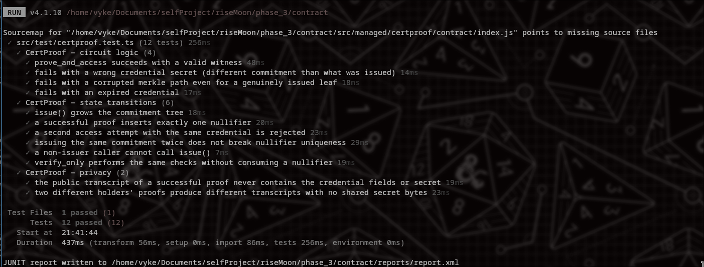

# CertProof

[](https://github.com/MrShiroLu/midnight-cert-proof/actions/workflows/ci.yml)

A confidential certificate verification dApp on Midnight: an issuer registers a
certificate as an opaque commitment, and the holder later proves on-chain that
they hold a valid, unexpired certificate without ever revealing its contents.

## Live Demo

- Live Demo: https://midnight-cert-proof.vercel.app
- Demo Video: https://youtu.be/KVycfq2xmrU


## Preprod Contract Address

| Contract | Network | Address |
|---|---|---|
| CertProof | Preprod | `e8d1976f5c2a47f6c933bbb60f86121102800453a6e1aadb72ea628e19d464fc` |

## What This Does

- **Issuer** deploys the contract and adds certificate **commitments** to an
  on-chain registry (a Merkle tree). Only the issuer's key can call `issue`.
- **Holder** generates the credential fields and a secret locally, derives the
  commitment, and hands only the commitment to the issuer.
- **Holder** later calls `prove_and_access`: the circuit recomputes the
  commitment from the (private) credential fields + secret + Merkle path,
  checks membership in the registry, checks the certificate hasn't expired,
  and inserts a **nullifier** so the same certificate can't be used twice at
  the same gate.
- An on-chain observer sees that *a* valid certificate was proven, never
  which one, and never its contents.

## Privacy Model

| Data | Where it lives | Disclosed to |
|---|---|---|
| Commitment registry (Merkle tree) | Public ledger | Everyone (opaque hashes) |
| Nullifier set | Public ledger | Everyone (unlinkable to identity) |
| Issuer public key | Public ledger | Everyone |
| Credential fields (name, ID, grade, expiry) | Private witness | No one |
| Holder secret + salt | Private witness | No one |
| Merkle path | Private witness | No one |
| "Valid credential proven" result | Public | Everyone |

**PUBLIC**: issuer key, commitment tree, nullifier set, issued/verified counts.
**PRIVATE**: credential contents, holder secret, Merkle path; these never
leave the holder's device.
**PROVED without revealing**: that the holder possesses *some* valid,
unexpired, not-yet-used certificate in the registry.

## Privacy Claim

An observer watching the chain can see: how many certificates were issued,
how many successful verifications happened, and who the issuer is.
An observer **cannot** see: certificate contents, which certificate was
proven, the holder's identity, or any link between two proofs by the same
holder. This is verified directly in `contract/src/test/certproof.test.ts`,
which serializes the full public transcript of a successful proof and asserts
the credential fields and secret never appear at the byte level (see
`contract/src/test/byte-scan.ts`).

## Prerequisites

- Node.js 20+
- The [Compact compiler](https://docs.midnight.network/) if you want to
  recompile the contract yourself (CI pins and installs it automatically).
- A local Midnight proof server (Docker) and the [Lace](https://docs.midnight.network/)
  wallet extension connected to Preprod, if you want to exercise real proving
  and wallet connection rather than the frontend's simulated flow:

  ```bash
  docker run -p 6300:6300 midnightnetwork/proof-server -- 'midnight-proof-server --network preprod'
  ```

## Setup & Run

```bash
npm install
npm run compact --workspace=contract   # recompile the circuits (optional, artifacts are checked in)
npm run dev --workspace=frontend       # http://localhost:5173
```

## Run Tests

```bash
npm test --workspace=contract
```


